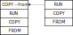

# Foundations

This section discusses theoretical foundations of Modus. Modus can be used without Understanding these foundations.

## Design Principles

- _Maintainability_: make build definitions maintainable by enabling modularity, code reuse and dependency resolution.
- _Efficiency_: make builds efficient by automatic parallelisation and fine-grained caching; provide tools for optimising the image size.
- _Expressiveness_: enable the user to express complex build workflows.
- _Simplicity_: provide minimalistic syntax and well-defined, non-Turing-complete semantics for build definitions.

## Build Model

A [Docker/OSI container image](https://opencontainers.org/) consists of a set of layers combined using a [union mount filesystem](https://en.wikipedia.org/wiki/Union_mount). To build an image, the user specifies the parent image and defines operations that are executed on top of the parent image to form new layers. The most common operations are copying local files into the container and executing shell commands. Another important operation which enables [multi-stage builds](https://docs.docker.com/develop/develop-images/multistage-build/) is copying files from another image. A multi-stage build can be visualised as the following graph. Each instruction in this graph creates a new filesystem layer. Instructions are specified using Dockerfile's notation: `FROM` defines the parent image, `COPY` copies local files, `RUN` executes shell command, and `COPY --from` copies files from another container.



The key insight of Modus is that this build modus naturally maps to [Horn clauses](https://en.wikipedia.org/wiki/Horn_clause), logical formulas in the form \\( u \leftarrow (p \wedge q\ \wedge ... \wedge\ t) \\). Particularly, container images correspond to logical facts, build rules are logical rules that derive new facts from existing facts, and the build graph is the minimal proof of the fact representing the build target from the facts representing existing images.

Consider the following recursive build script:

```Modusfile
a(mode) :- (
        mode = "production", from("alpine"), a("development")::copy("/app", "/app");
        mode = "development", from("gcc"), copy(".", "/app"), run("cd /app && make")
    )::set_workdir("/app").
```

For the query `a(X)`, where `X` is a variable, Modus computes the following build trees:

```
a("production")
╞══ from("alpine")
└── a("development")::copy("/app", "/app")
    ╞══ from("gcc")
    ├── copy(".", "/app")
    └── run("cd /app && make")
a("development")
╞══ from("gcc")
├── copy(".", "/app")
└── run("cd /app && make")
```

The subtree `a("development")` of the two trees is shared; it is only built once.

## Datalog

Datalog is a specific kind of Horn clauses with specific semantics. A good overview of Datalog is given in the following article:

_What You Always Wanted to Know About Datalog (And Never Dared to Ask)_<br>
Stefano Ceri, Georg Gottlob, Letizia Tanca<br>
IEEE TKDE 1989

Modus uses Datalog for several reasons:

- Datalog is declarative, the success of solving does not depend on the ordering of clauses (although the order of clauses is still important, as they determine the order of build steps);
- Datalog is expressive;
- in Datalog, the generation of minimal proofs is decidable.

Thus, Datalog presents a sweet spot between expressiveness and computatibility, which is important for a build system. Note that there is no fundamental connection between Datalog's expressive power and container builds. In fact, the expressiveness of the standard Datalog is not sufficient to conveniently express some natural build scenarios. For this reason, Modus supports two extensions, namely builtin predicates described in [Predicates](./library/predicates/README.md) and non-grounded variables. To realise these extensions, Modus uses a custom top-down Datalog solver for generating proofs.

### Non-Grounded Variables

Modus extends Datalog with non-grounded variables. To illustrate this extension, consider the following build script:

```Modusfile
a(cflags) :-
    from("gcc:latest"),
    copy(".", "."),
    run(f"gcc ${cflags} test.c -o test").
```

If the user specifies the query `a("-g")`, then Modus will build an image with a binary compiled with debug symbols. However, for the query `a(X)`, Modus will return an error, because the compilation flags `cflags` cannot be inferred from build definitions. This problem can be solved by, for example, adding possible compilation flags using a dedicated predicate:

```Modusfile
supported_flags("-g").
supported_flags("").

a(cflags) :-
    supported_flags(cflags),
    from("gcc:latest"),
    copy(".", "."),
    run(f"gcc ${cflags} test.c -o test").
```

For the later script, the query `a(X)` will results in two images: `a("-g")` and `a("")`.

In the standard Datalog, only the second variant is possible, because all variables have to be grounded (variables apearing in the head of a rule should also appear in the body, not in builtin predicates). However, specifying all possible values of all parameters is inconvenient. For this reason, Modus supports non-grounded variables. Specifically, it will make the best effort to initialise each variable in the rule before returning an error.

Builtin predicates in Modus has Prolog-like signatures that specify which parameters have to be initialised (see [Predicates](./library/predicates/README.md)). <!-- FIXME: https://github.com/rust-lang/mdBook/issues/984 -->
For user-defined predicates, variables which does not appear in the body always has to be initialised before the rule can be applied. For example, for the script:

```Modusfile
a(X) :- from("alpine"), run("echo Hello")
```

A query like `a("foo")` where `foo` is any string constant would build the same image, but a query like `a(X)` is simply not allowed. This allows each resulting image to be mapped to a constant literal like `a("foo")`.

### Proof Optimality

Modus searches for the optimal proof, that is the proof with minimal cost. The cost of a proof is the number of layers in the build DAG.

To illustrate proof optimality, consider again this build script:

```Modusfile
a(mode) :- (
        mode = "production", from("alpine"), a("development")::copy("/app", "/app");
        mode = "development", from("gcc"), copy(".", "/app"), run("cd /app && make")
    )::set_workdir("/app").
```

For the query `a("production")`, Modus will compute the following build trees:

```
a("production")
╞══ from("alpine")
└── a("development")::copy("/app", "/app")
    ╞══ from("gcc")
    ├── copy(".", "/app")
    └── run("cd /app && make")
```

However, if we add a new rule that uses a cached development image from a registry

```Modusfile
a("development") :- from("myregistry.domain.com/app:1.1-dev").
```

then the result of the query `a("production")` will become

```
a("production")
╞══ from("alpine")
└── a("development")::copy("/app", "/app")
    ╘══ from("myregistry.domain.com/app:1.1-dev")
```

because this tree involves fewer layer operations than the original one.

There may be situations when several minimal proofs of the same cost exist. In this case, Modus chooses one in an unspecified way. Although Modus is deterministic, reordering rules may cause Modus to generate a different minimal proof. To avoid non-determinism, it is recommend to avoid rules with uncontrolled choice:

```Modusfile
a :- b; c.
```

Instead, this rule can be re-written with an auxiliary variable to control the choice:

```Modusfile
a(choice) :-
    choice = "left", b;
    choice = "right", c.
```
